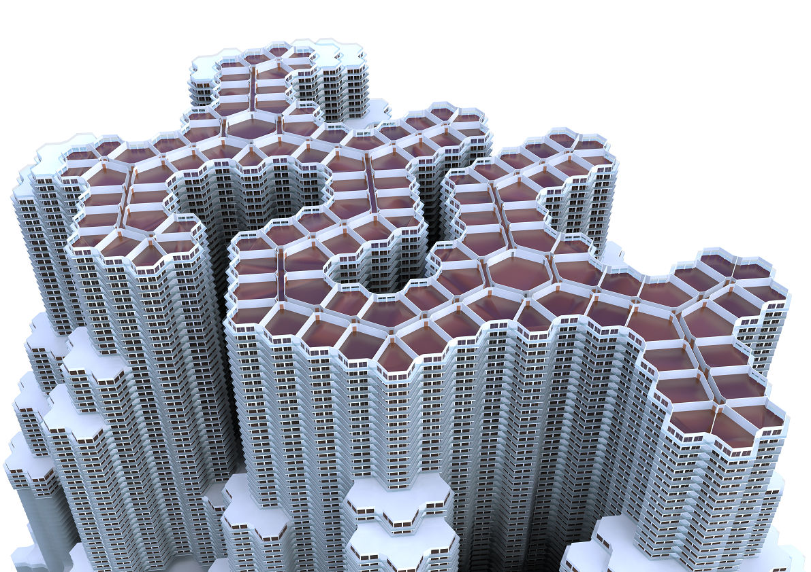

# Cell Tower Project in 2014

This is my project in 2014, even before I started GitHub.

The project is an application of my library, [RhinoArchitecturalLibrary](https://github.com/kurema/RhinoArchitecturalLibrary).
If you wanna make your own stuff like this, plaese use gh file [here](https://github.com/kurema/RhinoArchitecturalLibrary/releases).

## Files
| name | content |
| ---- | ------- |
| /render | Rendered contents |
| /render/main | Project images |
| /render/library_sample_result | Sample image of the library |
| /src | Grasshopper files |
| /src/Apartment/Apartment.6.gh | Final result of this project |
| /img | Images for documents |

Sorry for messy naming method. This is how I used to do, and I still often do for files unsuitable for VCS.

## Environment
Rhinoceros+Grasshopper

## Galary
### Cell Tower

### Other library results

